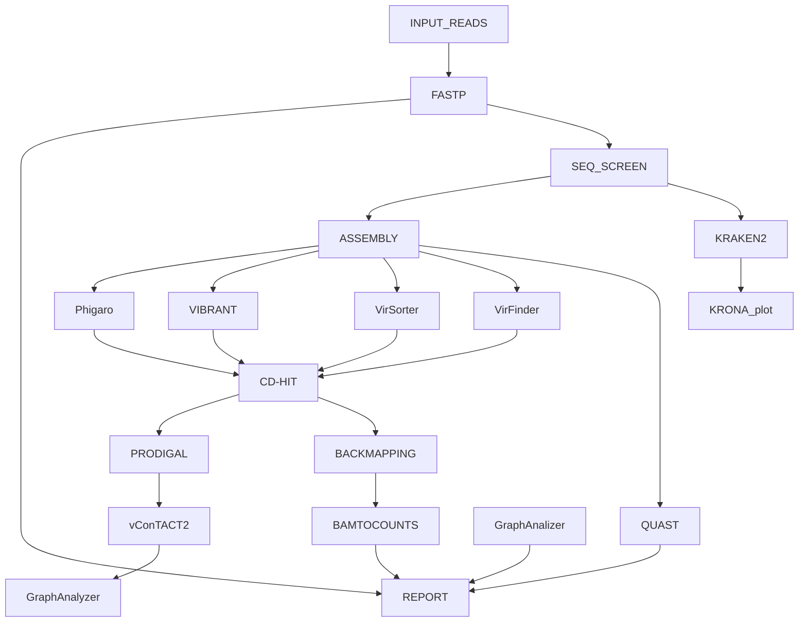

# magflow

```mermaid
graph TD;
 INPUT_READS --> FASTP;
 FASTP --> SEQ_SCREEN;
 SEQ_SCREEN --> KRAKEN2;
 KRAKEN2 --> KRONA_plot;
 SEQ_SCREEN --> ASSEMBLY;
 ASSEMBLY --> QUAST;
 ASSEMBLY --> VirFinder;
 ASSEMBLY --> VirSorter;
 ASSEMBLY --> VIBRANT;
 ASSEMBLY --> Phigaro;
 VirFinder --> CD-HIT;
 VirSorter --> CD-HIT ;
 VIBRANT --> CD-HIT ;
 Phigaro --> CD-HIT ;
 CD-HIT --> BACKMAPPING;
 BACKMAPPING --> BAMTOCOUNTS;
 CD-HIT --> PRODIGAL;
 PRODIGAL --> vConTACT2;
 vConTACT2 --> GraphAnalyzer;
 GraphAnalizer --> REPORT;
 BAMTOCOUNTS --> REPORT;
 FASTP --> REPORT;
 QUAST --> REPORT;
```
