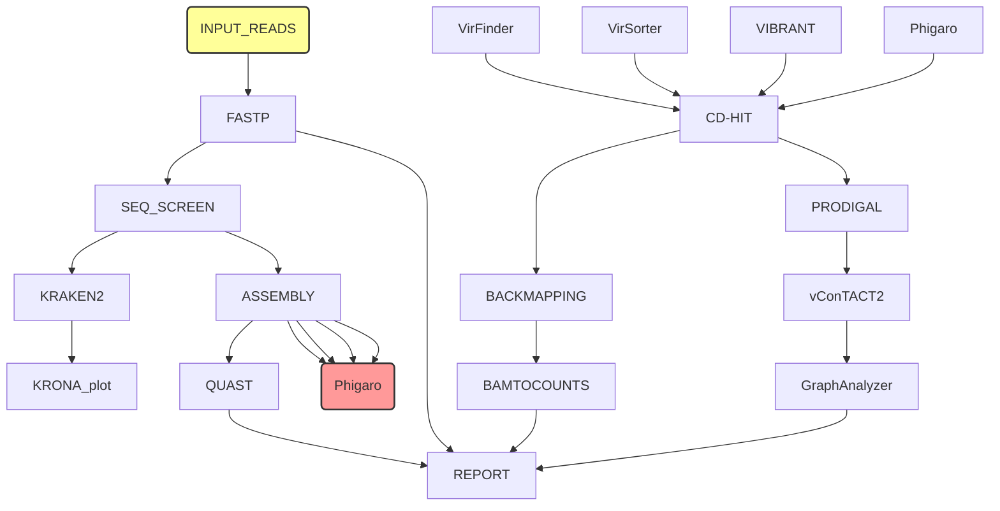

# magflow

```mermaid
graph TD;
 style input fill:#ff9,stroke:#333,stroke-width:2px
 style miner fill:#f99,stroke:#333,stroke-width:2px
 input(INPUT_READS) --> FASTP;
 FASTP --> SEQ_SCREEN;
 SEQ_SCREEN --> KRAKEN2;
 KRAKEN2 --> KRONA_plot;
 SEQ_SCREEN --> ASSEMBLY;
 ASSEMBLY --> QUAST;
 ASSEMBLY --> miner(VirFinder);
 ASSEMBLY --> miner(VirSorter);
 ASSEMBLY --> miner(VIBRANT);
 ASSEMBLY --> miner(Phigaro);
 VirFinder --> CD-HIT;
 VirSorter --> CD-HIT ;
 VIBRANT --> CD-HIT ;
 Phigaro --> CD-HIT ;
 CD-HIT --> BACKMAPPING;
 BACKMAPPING --> BAMTOCOUNTS;
 CD-HIT --> PRODIGAL;
 PRODIGAL --> vConTACT2;
 vConTACT2 --> GraphAnalyzer;
 GraphAnalyzer --> REPORT;
 BAMTOCOUNTS --> REPORT;
 FASTP --> REPORT;
 QUAST --> REPORT;
```
